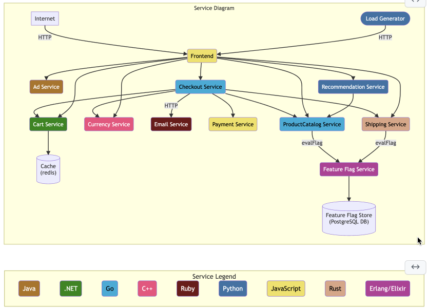
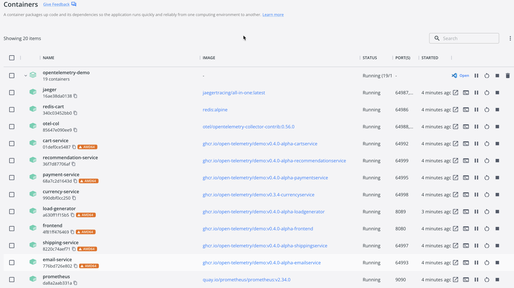

# Hands on Sentry

This tutorial shows how to configure the [OpenTelemetry Demo](https://github.com/open-telemetry/opentelemetry-demo) to be monitored by Sentry.



## Prerequisites
Currently, these instructions assume that you are on a Mac.
Windows and Linux version TBD.

### Homebrew
"Homebrew installs the stuff you need that Apple (or your Linux system) didn’t."

To install Homebrew, follow the instructions [here](https://brew.sh/).

### Git
We will use Git to clone our project from Github.

First, let's check if Git is already installed on your system.
For that open your terminal and run `git --version`.
If this returns a version, Git is already installed on your system.

If not, run `brew install git`.

After this operation is completed `git --version` should work as expected.

Next, Git needs to be configured.
For that, run

```sh
git config --global user.name "your_github_username"
git config --global user.email "your_email@acme.com"
```

### Docker
Our project uses Docker to run the various services.

To install Docker, download the installer for zour system from the [Docker website](https://docs.docker.com/desktop/install/mac-install/). 

Alternatively, Homebrew can also be used to install Docker.

### Visual Studio Code
We will have to modify the projects code when adding Sentry.
For this we will use Visual Studio Code.
If you have another text editor or IDE installed on your system already, you can use that as well.

To install Visual Studio Code follow [this link](https://code.visualstudio.com/) and download the version for your system.

Windows comes with an installer.
On your Mac, unzip the downloaded archive and move the unpacked binary into your `Applications` folder before running it.

## Setting up the project

In your terminal, change into the directory where the demo should be downloaded to.

1. Run: `git clone https://github.com/open-telemetry/opentelemetry-demo.git`.
2. Change into the project directory: `cd opentelemetry-demo`.

This will use Git to clone the project to your machine.

Now run `docker compose up` to spin up all the containers in this project. 

If this fails right away, make sure that Docker is running.

(Look at `docker-compose.yml` to review the instructions used by `docker compose` to accomplish this task)

This step can take several minutes to complete.

Once all the containers are up and running, log messages should appear on the terminal, indicating that the services are ready.

**Hint:** Open Docker Desktop to inspect your running containers.
.

Once the images are built and containers are started you can access:

* Webstore: http://localhost:8080/
* Jaeger: http://localhost:16686/
* Prometheus: http://localhost:9090/
* Grafana: http://localhost:3000/
* Feature Flags UI: http://localhost:8081/
* Load Generator UI: http://localhost:8089/

The demo also runs a load generator, which will continuously generate traffic, hitting all services.
